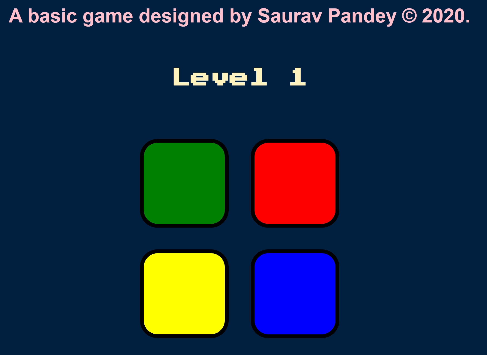

# Simon Game 🎮

A fun and challenging memory game built with HTML, CSS, and JavaScript. Test your memory as you follow along with a series of lights and sounds, trying to reproduce the sequence!



## Features 🌟

- **Interactive UI**: Brightly colored buttons that light up and animate upon click.
- **Sound Effects**: Each button press produces a unique sound, adding an auditory layer to the challenge.
- **Increasing Difficulty**: As you progress, the sequence gets longer, testing your memory limits!

## How to Play 🕹️

1. Open the Simon Game in your browser.
2. Press any key to start the game.
3. Watch and listen to the sequence produced by the game.
4. Reproduce the sequence by pressing the corresponding buttons.
5. As you progress, the sequence gets longer. How far can you go?

## Installation & Setup 🛠️

1. Clone the repository to your local machine:
```bash
git clone https://github.com/sauravpandey123/PlaySimon.git
